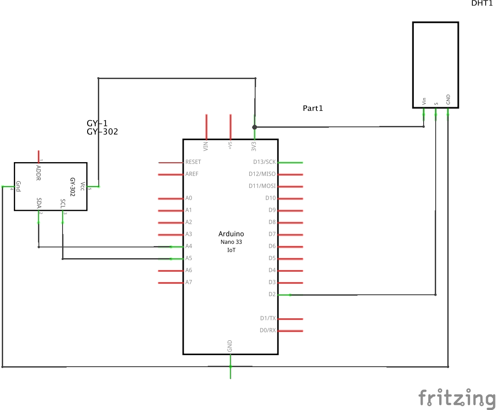
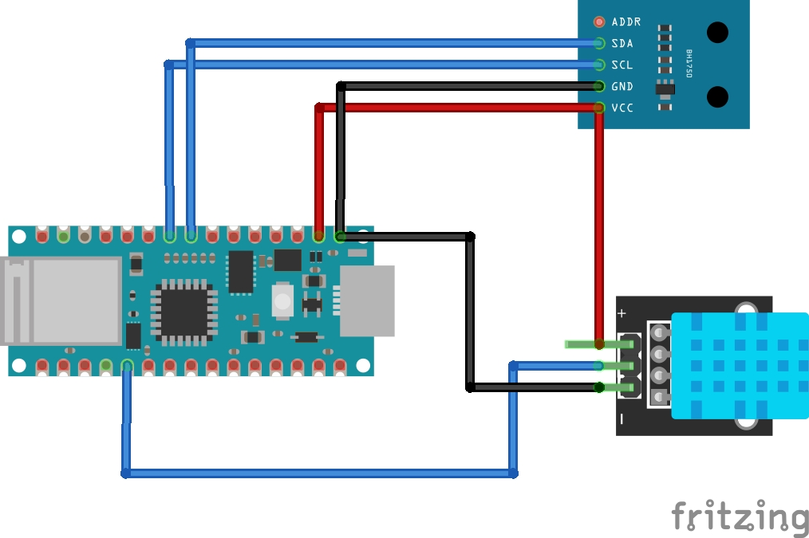
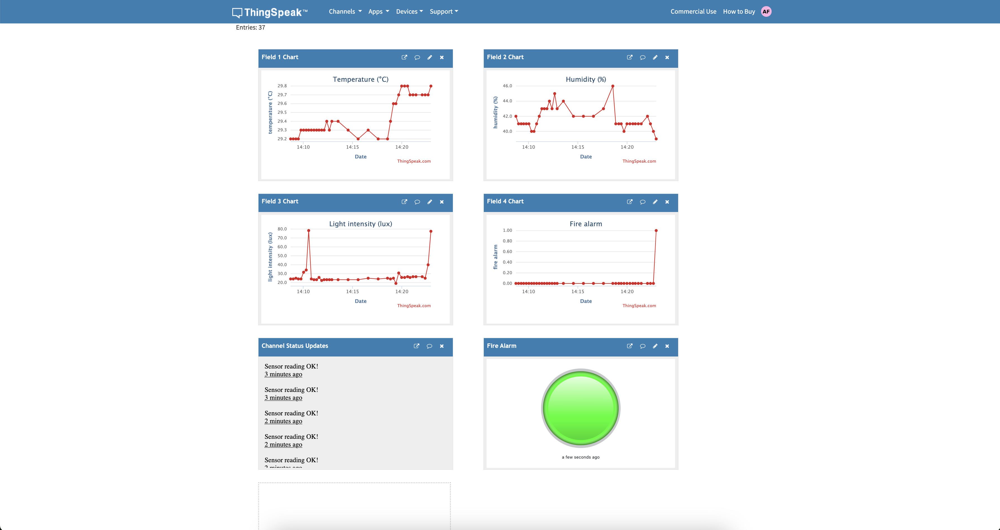

# Room Fire Monitor with Arduino Nano 33 IoT

A smart monitoring system that sends temperature, humidity, and light intensity data to ThingSpeak, featuring an automated fire alarm system.

## Features

- Real-time monitoring of environmental conditions
- Automatic fire detection based on multiple sensor thresholds
- Data visualization through ThingSpeak platform
- Built-in LED indicator for local alerts

## Hardware Requirements

- Arduino Nano 33 IoT
- DHT11 sensor (temperature and humidity)
- BH1750 sensor (light intensity)
- Breadboard and jumper wires

## Wiring Diagram

Connect components as shown in the schematic below:

### Fritzing Schematic

## Required Libraries

- WiFiNINA
- ThingSpeak
- DHT sensor library by Adafruit
- BH1750 by Christopher Laws

See code comments and documentation for setup and configuration details.

## ThingSpeak Dashboard

The following screenshots show the real-time data visualization in ThingSpeak:

### ThingSpeak Charts

